# VSCode Prolog Toolkit

A robust, production-grade VS Code extension for SWI-Prolog, building on [AmauryRabouan/new-vsc-prolog](https://github.com/AmauryRabouan/new-vsc-prolog) and [Arthur Wang's VSC-Prolog](https://marketplace.visualstudio.com/items?itemName=arthurwang.vsc-prolog).

**Repository:** https://github.com/mediaprophet/VSCode-Prolog-Toolkit  
**Author:** Timothy Holborn  
**Credits:** Major features and inspiration from [Amaury Rabouan](https://github.com/AmauryRabouan/new-vsc-prolog) and contributors.

---

___________________
  [Features](#features) | [Configurations](#configurations) | [Debugger Settings](#debugger-settings) | [Commands & Keybindings](#commands-keybindings) | [Bug Reporting](https://github.com/AmauryRabouan/new-vsc-prolog/issues) 


## About This Fork

This toolkit is a comprehensive refactor and extension of [new-vsc-prolog](https://github.com/AmauryRabouan/new-vsc-prolog), with:
- A robust Node.js backend using HTTP/JSON for all Prolog communication
- Advanced chat-based Prolog and N3 logic interaction (see below)
- Full test coverage, CI, and production-grade error handling
- Enhanced diagnostics, output formatting, and extensibility

Tested on Windows, macOS, and Linux with SWI-Prolog 9.0.4+ and VS Code 1.86+.

## Features
  * [Syntax highlighting](#syntax-highlighting)
  * [Snippets](#predicate-snippets)
  * [Information Hovers](#information-hovers)
  * [Linter](#grammar-linter)
  * [Edit helpers](#edit-helpers)
    * [Import/Dynamic helper (SWI ONLY)](#import-or-dynamic-predicate-helper)
    * [Export helper (SWI ONLY)](#export-helper)
    * [Recursion helper](#recursion-helper)
    * [Anonymous variable helper](#anonymous-variable-helper)
  * [Load active source file and query goals](#load-active-source-file-and-query-goals)
  * [Goto definition of predicate under cursor](#go-to-definition)
  * [Show all refences of predicate under cursor](#show-all-references-of-predicate-under-cursor)
  * [Refactor predicate under cursor(experimental)](#refactor-predicate-under-cursor)
  * [Code formatter](#code-formatter)
  * [Chat Assistant with N3 Logic Support](#chat-assistant-with-n3-logic-support)
    * Interactive Prolog queries and file consultation
    * N3/Turtle knowledge base loading and reasoning
    * Proof tree generation and explanation
    * Semantic web reasoning with RDFS inference
  * [Enhanced Reasoning Features](#enhanced-reasoning-features)
    * Constraint Logic Programming (CLP) with CLP(FD), CLP(R), and CLP(Q) support
    * Probabilistic logic with Monte Carlo sampling and uncertainty quantification
    * User-defined logic modules with custom meta-interpreters
    * Integration with existing N3/semantic web reasoning
  * [Debugger(experimental, SWI ONLY)](#debugger)
    * Leep, creep, skip, Up, Stop, Restart
    * Breakpoints, including conditional breakpoints and hit count breakpoints
    * Spy(function breakpoints)
    * Data inspection
    * Evaluation

## Feature descriptions and usages

### Syntax highlighting
  * Based on sublimeprolog
  * Builtin pattern support

  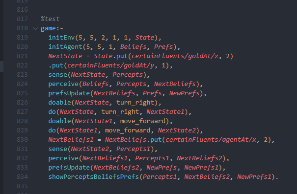

### Predicate snippets

  * Predicate templates auto-completion
  * Produced from source files with structured comments and html document of swipl system
  * Produced from created predicates, if there is structured comments from the user, it give their description (see example)

  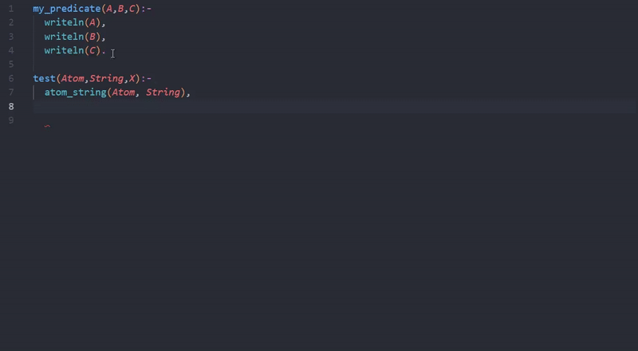
  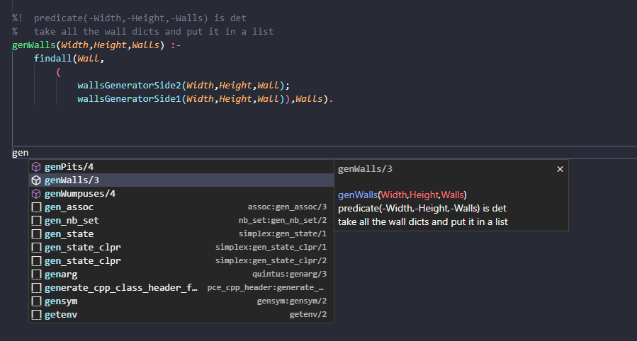


### Information hovers
  Hovers show Document information about the predicate under the mouse cursor.

  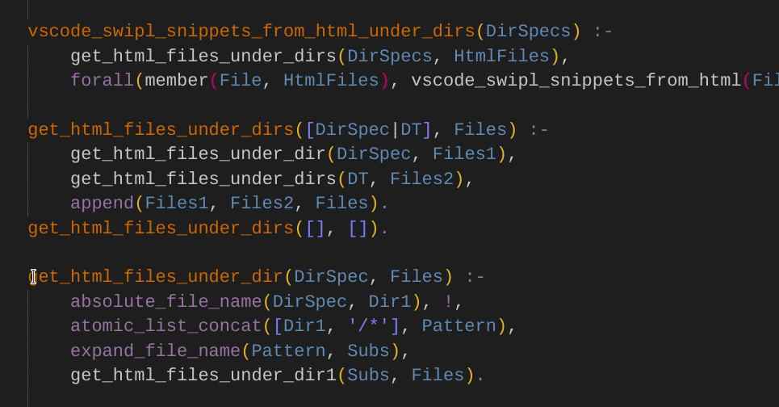

### Grammar linter
  * Lint for errors, warning and undefined predicates of the source file in active editor window and its imported file
  * Errors are marked with red squiggles, Warnings green ones.
  * Mesage shown in OUTPUT and PROBLEMS channels
  * Clicking lines in PROBLEMS channels brings cursor to the respective lines in the editor
  * Traverse error lines in the editor by commands, the error/warning message responding to the line is presented in OUTPUT channel.
    * Prolog: Goto next error line (default map to f8) 
    * Prolog: Goto previous error line (default map to shift-f8)
  * Linter can be configured as action upon saving, typing and disabled by setting prolog.linter.run to 'onSave', 'onType' and 'never' respectively
    

### Edit helpers

#### Import or Dynamic predicate helper

  Clicking on the squiggle indicating 'undefined predicate' lights the yellow bulb in the left margin besides the line number. A suggesition list is presented when you click the bulb that includes 'add dynamic ' for the undefined predicate or 'import' it if VSC-Prolog finds it could be exported from some module(s). Triggering 'Add dynamic' inserts the predicate indicator into dynamic directive, or creates such a directive if no one exists. 'Add use_module' inserts ':- use_module' directive with the predicate indicator whithin the import list.

  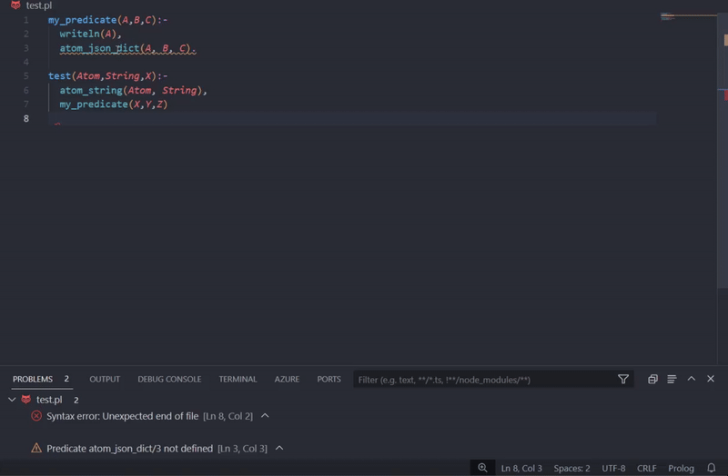

#### Recursion helper

  Leading dot (only spaces before it) of a line repeat the above nearest predicate or the head of current clause being edited if last line ends with comma, in which case the recursive variable change accordingly as intelligent as possible.
 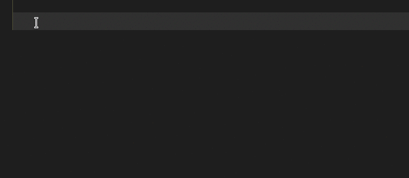

#### Anonymous variables helper

  Typing underscore in front of any parameters makes the parameter an anonymous variable.
  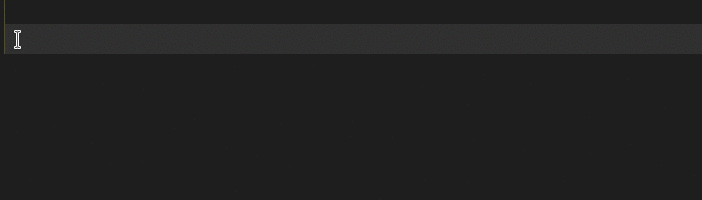

### Load active source file and query goals

  * Command 'Prolog: load document' 
    (default map to alt-x l) loads the source file in active editor into prolog process in the integrated terminal, spawning the prolog process it if not opened. The prolog process provides a real prolog REPL console. 

  * Command 'Prolog: query goal under cursor'
    (default map to alt-x q) loads the source file and querys the goal under the cursor. You can call this command from editor context menu.
  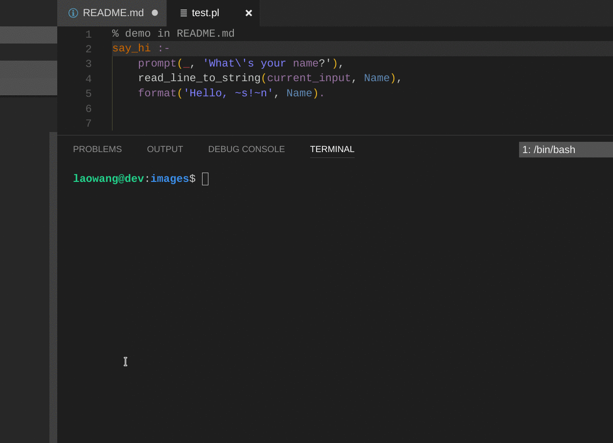

### Go to definition of predicate under cursor
  * Go to definition

    Editor/context menu command 'Go to Definition' (default map to f12) brings the cursor to the line where where the predicate is defined.
  * Peek definition

    Editor/context menu command 'Peek Definition' (default ctrl-shift-f10) pops up a panel to display the definition.

   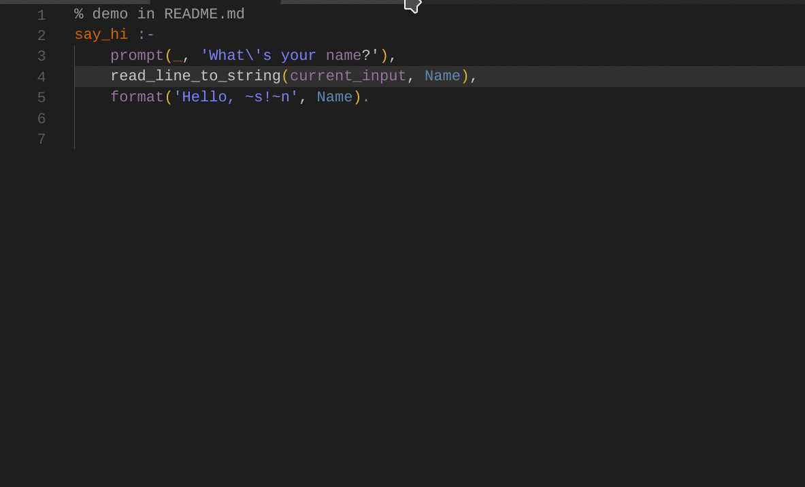

### Show all references of predicate under cursor

  Right click a predicate in editor, then trigger the command 'Find all references' from the editor context menu. All references of the predicate will be displayed in a popup panel.

  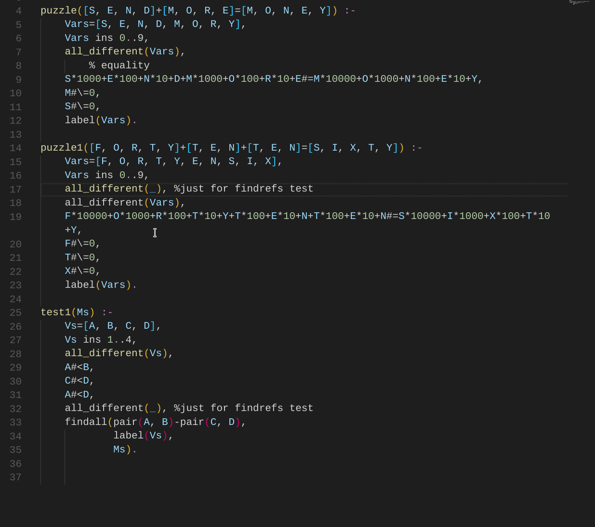

### Refactor predicate under cursor

  Right click a predicate in editor, then trigger the command 'Refactor predicate under cursor' from the editor context menu. VSC-Prolog pops up a message box to ask for user confirmation and then an input box shows off to accept new predicate name that is used to replace the original one in all the references and its definition clause head(s). 
  
  If the user selects a builtin or foreign predicate and confirms in the warning box, all the predicate functor names of referencs would be replaced but the definition remains unchanged. This maybe is useful if you want to substitute a predicate with the same arity.

  > You'd better to commit the current stage of the version control system in VS Code before refactoring action in order to rollback refactoring results easily with one command of 'discard all changes' when the results are not what you expected.
  
  

### Code formatter

  Code formatting is iterative on all clauses, removing unnecessary spaces and adding new ones. It returns to the line by adding the number of tabs corresponding to the number of paratheses and braces.


  VSC-Prolog formats codes for three scopes of active document in editor:
   * document scope
    
    Right click any area of active prolog source document in editor to pop up editor context menu, then trigger the command 'Format Document' (default map to alt+shift+f). The whole document would be formatted.

  * selection scope

    Select an range and right click on the selection to pop up editor context menu, then trigger the command 'Format Selection' (default map to ctrl+k ctrl+f). VSC-Prolog would enlarge the selection to include complete terms if necessary and format the selection.

    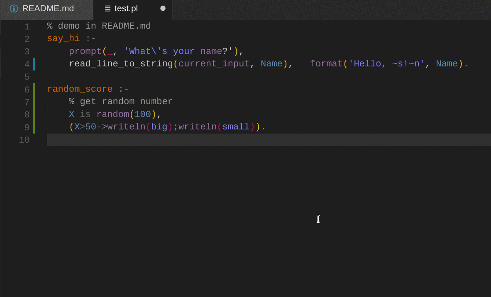

### Chat Assistant with N3 Logic Support

#### Major Enhancements in This Toolkit

- **Robust HTTP-based backend**: Node.js module manages SWI-Prolog as a child process, communicating via JSON over HTTP for all queries, consults, help, and N3 logic.
- **Production-grade error handling**: Automatic recovery, input validation, timeouts, and logging.
- **Comprehensive test suite**: Mocha/Chai/ts-node tests for all features, with logs and problems output for CI.
- **N3 logic and semantic web**: Advanced N3/Turtle reasoning, proof trees, and semantic web support, with a dedicated [N3 Reasoning Guide](docs/n3-reasoning-guide.md).
- **Extensible architecture**: Modular design for adding new language features, chat commands, and backend protocols.


 The extension includes an intelligent chat assistant that provides interactive support for Prolog development and N3 logic reasoning. Access the chat by opening the VS Code Chat panel and typing `@prolog`.

#### Core Chat Commands

 * **Query Execution**: `/query <goal>` - Execute Prolog queries interactively
   ```
   @prolog /query member(X, [1,2,3])
   @prolog append([1,2], [3,4], X)
   ```

 * **File Consultation**: `/consult <file>` - Load Prolog files into the session
   ```
   @prolog /consult family.pl
   @prolog /consult logic/rules.pl
   ```

 * **Help System**: `/help <predicate>` - Get documentation for predicates
   ```
   @prolog /help member/2
   @prolog /help findall/3
   ```

 * **Status Check**: `/status` - Check backend and extension status

#### N3 Logic Commands

 The chat assistant supports advanced N3 (Notation3) logic reasoning:

 * **Load N3 Data**: `/n3_load` - Load N3/Turtle knowledge bases
   ```
   @prolog /n3_load sample.n3
   @prolog /n3_load --content "@prefix : <http://example.org/> . :socrates a :Person ."
   ```

 * **List Triples**: `/n3_list` - Display loaded RDF triples
   ```
   @prolog /n3_list --limit 20
   @prolog /n3_list --format readable
   ```

 * **Reasoning**: `/n3_reason` - Perform semantic reasoning
   ```
   @prolog /n3_reason
   @prolog /n3_reason rdf(X, type, Mortal)
   ```

 * **Proof Explanation**: `/n3_explain` - Generate proof trees
   ```
   @prolog /n3_explain rdf(socrates, type, Mortal)
   ```

#### Key Features

 * **Interactive REPL**: Real-time Prolog query execution with variable bindings
 * **Semantic Web Support**: Full N3/Turtle parsing and RDFS reasoning
 * **Proof Trees**: Visual explanation of reasoning steps and rule applications
 * **Error Handling**: Comprehensive error messages with fallback suggestions
 * **Auto-completion**: Context-aware command suggestions and follow-ups

 For detailed N3 usage examples and syntax, see the [N3 Reasoning Guide](docs/n3-reasoning-guide.md).

### Enhanced Reasoning Features

The extension now includes comprehensive enhanced reasoning capabilities that extend beyond traditional Prolog and N3 logic:

#### Constraint Logic Programming (CLP)

Advanced constraint solving over multiple domains:

* **CLP(FD) - Finite Domain Constraints**
  ```
  @prolog /clp_solve --domain fd --variables "X,Y" --constraints "X #= Y + 1, X #< 10, Y #> 0"
  @prolog /clp_solve --domain fd --variables "A,B,C" --constraints "all_different([A,B,C]), A in 1..3, B in 1..3, C in 1..3"
  ```

* **CLP(R) - Real Number Constraints**
  ```
  @prolog /clp_solve --domain r --variables "X,Y" --constraints "X =:= Y * 2.5, Y >= 1.0, X =< 10.0"
  ```

* **CLP(Q) - Rational Number Constraints**
  ```
  @prolog /clp_solve --domain q --variables "X,Y" --constraints "X =:= Y / 3, Y > 0"
  ```

* **Persistent Constraints**
  ```
  @prolog /clp_constraint --domain fd --constraint "X #> 0"
  ```

#### Probabilistic Logic

Handle uncertain knowledge with Monte Carlo sampling:

* **Define Probabilistic Facts**
  ```
  @prolog /probabilistic_fact --fact "weather(sunny)" --probability 0.7
  @prolog /probabilistic_fact --fact "traffic(heavy)" --probability 0.4
  ```

* **Probabilistic Inference**
  ```
  @prolog /probabilistic_query --goal "weather(sunny)" --samples 1000
  @prolog /probabilistic_query --goal "traffic(heavy)" --method monte_carlo --samples 500
  ```

#### User-defined Logic Modules

Create custom reasoning systems with specialized rules:

* **Register Logic Modules**
  ```
  @prolog /logic_module_register --name "philosophy" --rules "mortal(X) :- human(X). human(socrates). human(plato)."
  @prolog /logic_module_register --name "animals" --rules "animal(X) :- mammal(X). mammal(dog). mammal(cat)." --meta_interpreter custom
  ```

* **Query Logic Modules**
  ```
  @prolog /logic_module_query --module "philosophy" --goal "mortal(X)"
  @prolog /logic_module_query --module "animals" --goal "animal(X)"
  ```

* **List Available Modules**
  ```
  @prolog /logic_module_list
  ```

#### Integration Features

* **Combined Reasoning**: CLP constraints with probabilistic inference
* **Semantic Integration**: Logic modules working with N3/RDF data
* **Proof Tracing**: Explanation trees for all reasoning types
* **Performance Optimization**: Efficient constraint solving and sampling algorithms

For comprehensive documentation, examples, and API reference, see the [Enhanced Reasoning Guide](docs/enhanced-reasoning-guide.md).

#### Testing and Development

The extension includes comprehensive testing infrastructure:

- **Unit Tests:** Backend components with mocking/stubbing
- **Integration Tests:** Full chat command testing
- **N3 Logic Tests:** Semantic reasoning validation
- **Performance Tests:** Scalability and memory usage
- **CI/CD Pipeline:** Automated testing on multiple platforms

Run tests locally:
```bash
# Setup test environment
npm run setup-test-env

# Run all tests
npm run test:all

# Run specific test suites
npm run test              # Backend unit tests
npm run test:n3           # N3 integration tests
npm run test:enhanced     # Enhanced reasoning tests (CLP, probabilistic, logic modules)
npm run test:performance  # Performance tests
npm run test:coverage     # Coverage analysis
```

For troubleshooting and error resolution, see the [Troubleshooting Guide](docs/troubleshooting.md).

### Debugger

  The experimental debugger of VSC-Prolog tries to visualize the command line tracer of SWI-Prolog in VS Code. Read [VS Code handbook about debugging](https://code.visualstudio.com/docs/editor/debugging) for how VS Code debugging works generally.
  
  For the first time to debug in VS Code it is necessary to setup a launch.json file under .vscode directory in a project root. VS Code pops down a list of debug environments when you first click 'start debugging' button (f5) or the gear icon. The list contains 'Prolog' if VSC-Prolog extension is installed. A default launch.json file would be generated. Among the all settings, two must be set firstly: 'runtime executable' and 'startup query' according to your environment. 'runtime executable' points to your swipl executable path and 'startup query' refers to the goal you want to start debugging. ___There is only one file containing the 'startup goal' in a project.___ Refer to next section for detailed explanations about other settings.

  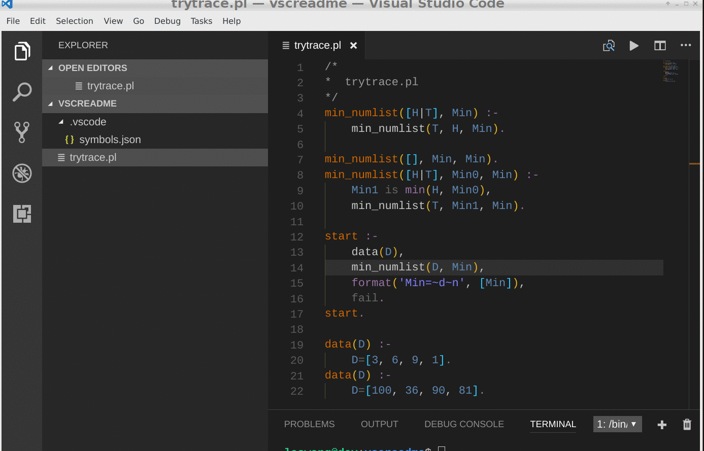
* Trace options

  VSC-Prolog debugger supports basic trace options: leep, creep, skip, up, stop and restart.

  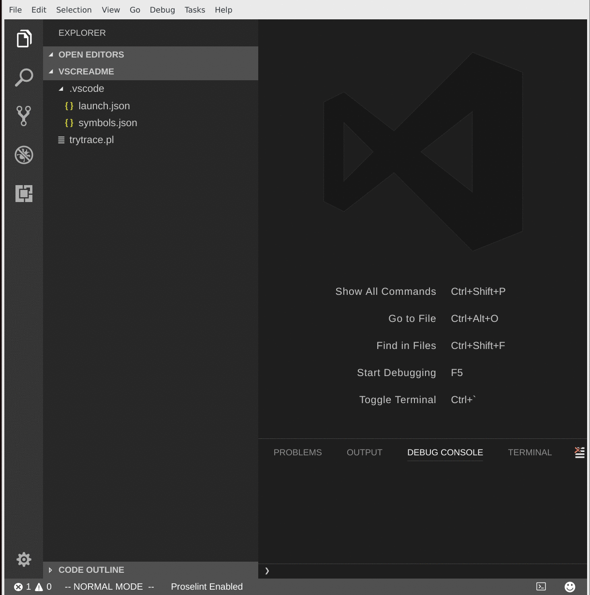

* Breakpoints

  Before starting debugging, left click the editor margin on left of line number to toggle breakpoints. On debugging, the prolog process verifies the breakpoints and marks unverified ones with grey color. (Not working for now)
  > Note the limit of VSC-Prolog: Breakpoints must be set before starting debugging. Any breakpoints set during debugging are unavailable until next debugging process.

  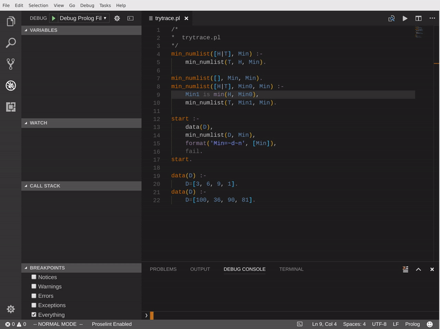

  * Conditional breakpoints

    Conditional breakpoints or expression breakpoints will be hit whenever the expression evaluates to true. Right click the red dot of the breakpoint to open the menu list which contains 'Edit Breakpoint' item that is a option list including 'Expression' and 'Hit Count'. Select 'Expression' to enter the condition for execution to stop. In VSC-Prolog, the expressions must be legal prolog predicates. Usually when the variables bind to some values the predicates success and the execution pauses at the breakpoint, as shown in the gif animation below where 'length(T, 1)' is the condition to break when the length of T is 1.

    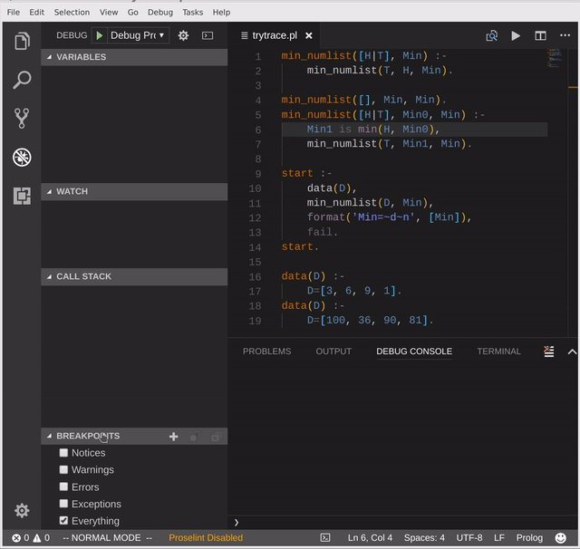

  * Hit count breakpoints

    The 'hit count' controls how many times a breakpoint needs to be hit before it will 'break' execution. That is, how many times execution passes the breakpoint before it pauses. Right click the red dot of the breakpoint to open the menu list which contains 'Edit Breakpoint' item that is a option list including 'Expression' and 'Hit Count'. Select 'Hit Count' to enter the number of the least hits to pass before stop.

    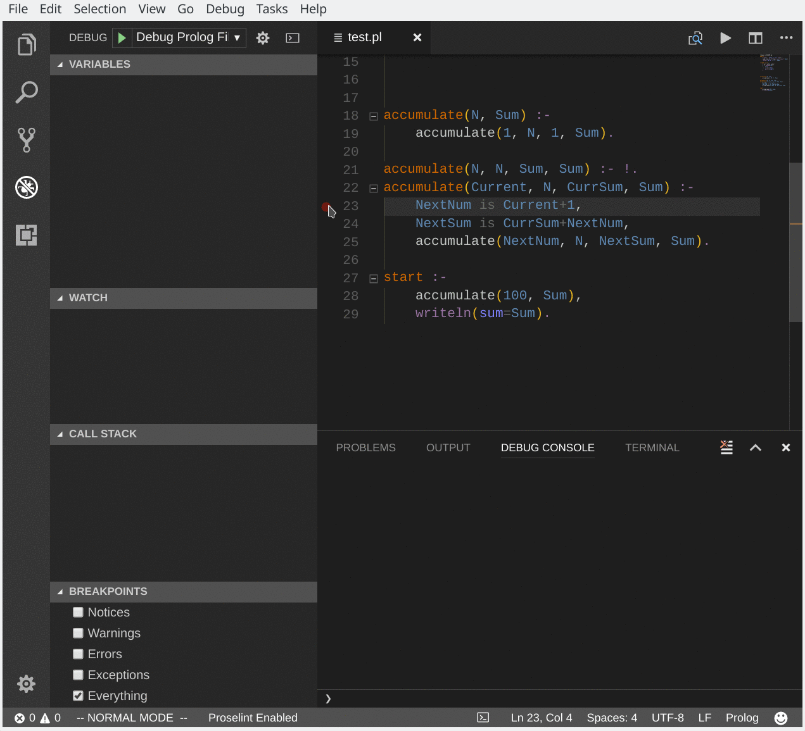

  * Spy predicates

    VSC-Prolog implements spy predicates via function breakpoints in VS Code. 
    > Note: Spy predicates are not shown as breakpoints in editor. A 'spy breakpoint' is created by pressing the + button in the BREAKPOINTS section header and entering the predicate indicator.

    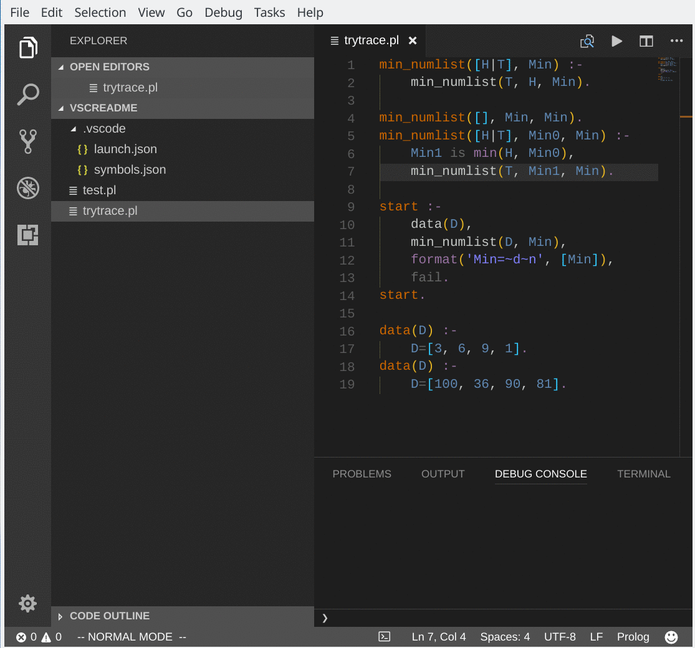

* Data inspection

    Variables with their bound values whithin current clause can be inspected in the VARIABLES section of the Debug view or by hovering over their source in the editor or in the WATCH section.

    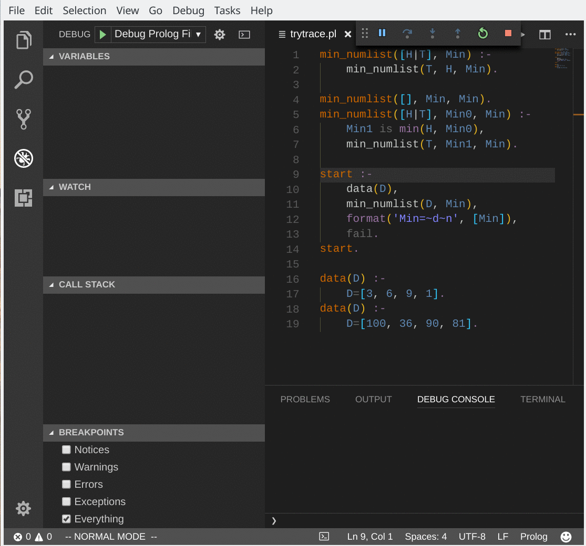

    Debug Console is consist of output area and an input box. The output area displays all outputs from debugging and the input box can be used to input goals to evaluate in which you can use variables with current bound values.

    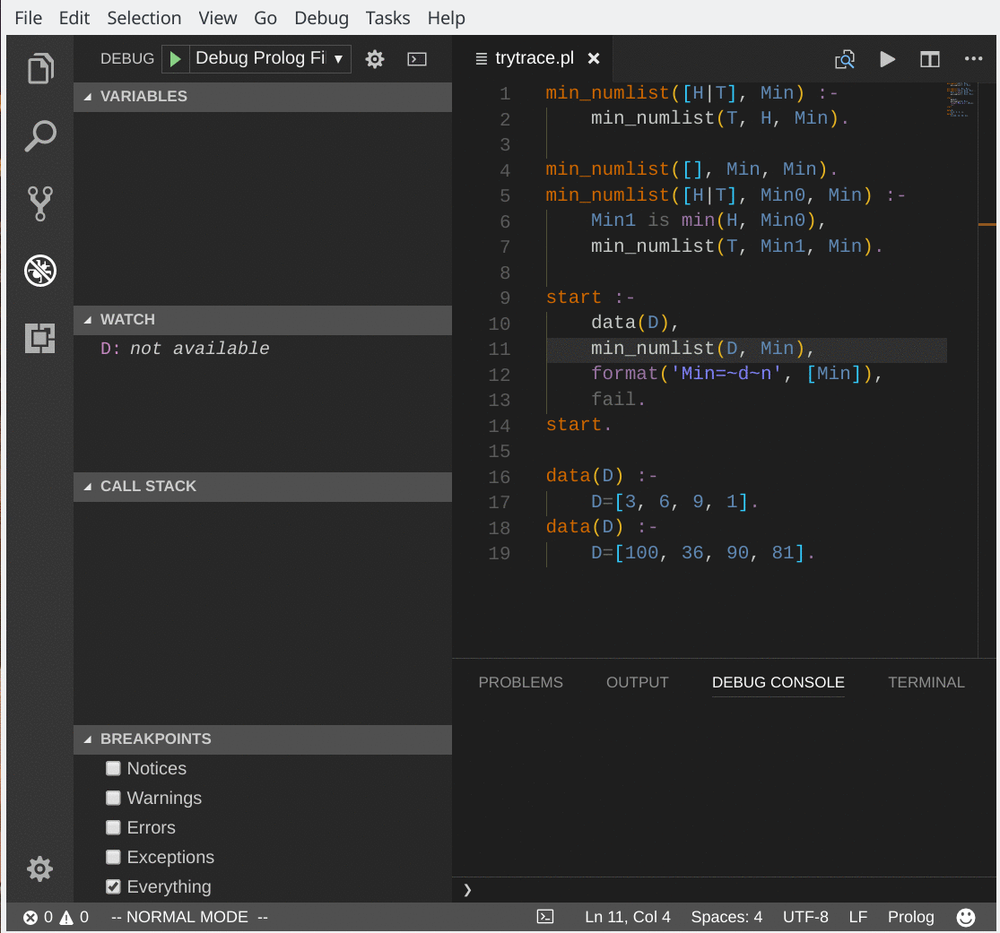
  
    > Note about input from stdin during debugging:
    > 
    > The input box is also used to accept user input during debugging. While  a program is waiting for input from user, the yellow arrow indicating trace location would disappear. At this time you ___type firstly a semicolon___ followed by your real input contents. Another important point is that the prolog system prompt (default |:) would not show off anywhere, unless outputting prompts by stdout or stderr which piped to debug output area.

    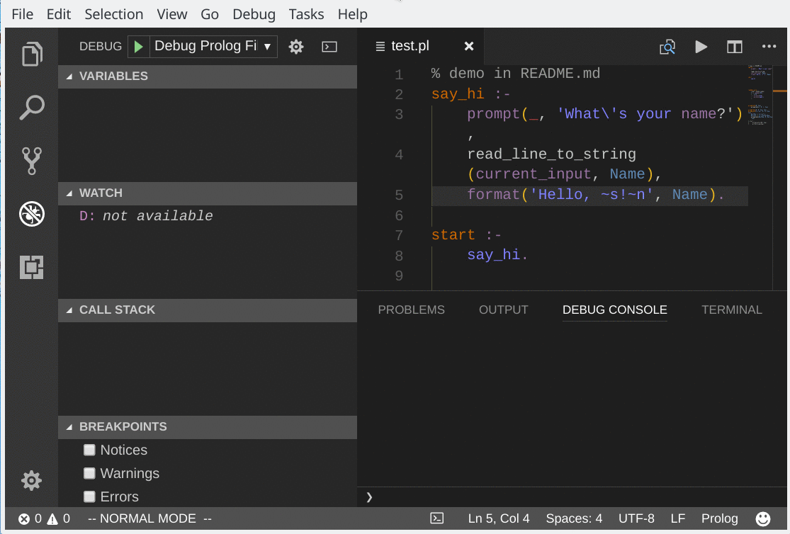

## Requirements

- **VS Code:** Version 1.86 or later
- **SWI-Prolog:** Version 9.0.4 or later (recommended)
- **Node.js:** Version 18.x or later (for development)
- **Operating System:** Windows 10+, macOS 10.15+, or Ubuntu 18.04+

### Installation Instructions

1. **Install SWI-Prolog:**
   ```bash
   # Ubuntu/Debian
   sudo apt-get install swi-prolog
   
   # macOS (using Homebrew)
   brew install swi-prolog
   
   # Windows (using Chocolatey)
   choco install swi-prolog
   ```

2. **Install the Extension:**
   - Open VS Code
   - Go to Extensions (Ctrl+Shift+X)
   - Search for "New-VSC-Prolog"
   - Click Install

3. **Configure SWI-Prolog Path (if needed):**
   - Open VS Code Settings (Ctrl+,)
   - Search for "prolog.executablePath"
   - Set the path to your SWI-Prolog installation

## Configurations

  * There are seven configurable settings with default values in VSC-Prolog:
    * "prolog.dialect": "swi",

      What dialect of prolog used:
        * swi: SWI-Prolog

    * "prolog.executablePath": "/usr/bin/swipl"

      Points to the Prolog executable.
    
    * "prolog.linter.run": "onType"

      How to trigger the linter: onType or onSave or never. 'onType' means linting is in nearly real time manner (controlled by next setting: prolog.linter.delay) whileas 'onSave' linter is called when saving the document. 'never' disables the linter.

    * "prolog.linter.delay": 500

      The milliseconds to delay when using onType trigger, that is, when pausing over this milliseconds between two key strokes the linter would be triggered.

    * "prolog.terminal.runtimeArgs": [ ]

      Arguments of Prolog executable run in terminal. This prolog process is used to load and execute the program in active editor, including 'query goal under cursor' command. This is a array of strings, i.e. ['-q', '-f', 'none'].

    * "prolog.format.enabled": true
       
       Enable or disable formatting source code.

    * "prolog.format.tabSize": 4
    
      The size of a tab in spaces, this and next setting affect the layout of formatted codes.

    * "prolog.format.insertSpaces": true,

      Prefer spaces over tabs

## Debugger settings

  Every project must have a launch.json configuration file under .vscode directory before starting debugging. VSC-Prolog's launch.json schema is excerpted as follows from the package.json of VSC-Prolog project. This file can be edited directly after generated for the first time to debug. 
  
  * program

    type: string

    default: "${file}"
    
    > DESCRIPTION:
    > Absolute path to the program. This parameter refers to the source file to start debugging. The default value '${file}' means the  active document file in editor when debugger is triggered.

  * startupQuery

    type: string

    default: "start"

    > DESCRIPTIO: The goal to query for starting debugging. VSC-Prolog debugger needs a point to start execution, this parameter is set for that purpose. The default value 'start' means that a start/0 predicate exists in active document. Any predicates can be used as entry point, as long as it can be queried and matched with this parameter setting.

  * stopOnEntry

    type: boolean

    default: true

    > DESCRIPTION: Automatically stop program after launch at entry point if this parameter set to 'true'. If set to 'false', the program would execute until a breakpoint, satisfied conditional breakpoint or hit count breakpoint or a spy predicate, otherwise go to the end if there are no such breakpoints. 

  * cwd

    type: string

    default: "${workspaceRoot}"

    > DESCRIPTION: Absolute path to the working directory of the source file being debugged. ${workspaceRoot} points to the root of user project.

  * env

    type: object

    default: {}

    additionalProperties: {type: string}

    > DESCRIPTION: Environment variables passed to the source file.

  * runtimeExecutable

    type: string

    default: "/usr/bin/swipl"

    > DESCRIPTION: Debug process executable. You can lookup it via 'which' command in unix-like operating system.

  * runtimeArgs

    type: array

    items: {type: string}

    default: []

    > DESCRIPTION: Command line arguments passed to the debug executable. It's an array of strings, i.e. ['-q', '-g', 'writeln(hello)'].

  * traceCmds

    type: object
    
    default: {"continue": ["leap", "l"], "stepover": ["skip", "s"],            "stepinto": ["creep", "c"], "stepout": ["up", "u"]}

    >  DESCRIPTION: Mapping between vscode debug commands and prolog trace options. They are command line tracer options VSC-Prolog supports. Reserved for multiple prolog systems supports in future. Don't modify them now.

##  Commands keybindings

   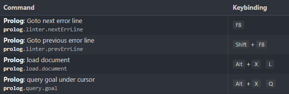

## Known Issues

  * During debug tracing, prompt for stdin input doesn't display in debug console.

  * Syntax highlighting does not support multiline regular expression match, that's choosen by design of Sublime tmlanguage. Thus syntax highlighting maybe is wrong some times.

  * The debugger has limited support for advanced reasoning features (CLP, probabilistic logic, logic modules) - use chat commands for full functionality.

## [Release Notes](CHANGELOG.md)


## Bug Reporting & Contributions

Please report bugs or suggestions via [issues](https://github.com/mediaprophet/VSCode-Prolog-Toolkit/issues).

Pull requests and contributions are welcome! See [CONTRIBUTING.md](CONTRIBUTING.md) for guidelines.


## Contributions

  [Pull requests](https://github.com/AmauryRabouan/new-vsc-prolog/pulls) are welcome.


## Acknowledgements

- [Amaury Rabouan](https://github.com/AmauryRabouan/new-vsc-prolog) and [Guillaume Nollet](https://www.linkedin.com/in/guillaume-nollet/) for the original new-vsc-prolog
- [Arthur Wang](https://marketplace.visualstudio.com/items?itemName=arthurwang.vsc-prolog) for the original VSC-Prolog
- [ESIEA](https://www.esiea.fr/en/) for supporting the original project

This toolkit would not exist without their foundational work.

## License

  [MIT](http://www.opensource.org/licenses/mit-license.php)
